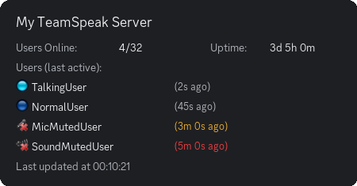

# Discord TeamSpeak Status Bot

<div align="center">
  
</div>

Discord bot to monitor and display TeamSpeak server status in Discord channels via ServerQuery. 

Supports posting to multiple Discord channels. Assumes necessary privileges have been granted to the bot (view, delete, edit, post) for each channel.

Supports SSH/Telnet connections. For TeamSpeak 6 servers, SSH is **required**.

Image based monitoring requires an [Cloudinary](https://cloudinary.com/) API key in Discord message attachments cannot be edited. Every update, a new image is uploaded to Cloudinary and the embed is updated to show the new URL. Free version works good enough.

Missing the Cloudinary API key, a [text based fallback view is supported](docs/text_fallback.png).

## Setup
### Docker (recommended)
Just deploy a docker image with the required config variables set.
[Docker Hub](https://hub.docker.com/r/rale2k/discord-ts3-status)
[Example compose file](./docker-compose.yml)

### Locally (for testing)
1. **Install dependencies:**
   ```bash
   pip install -r requirements.txt
   ```

2. **Configure the neccessary environment variables:**
   Populate the following variables mentioned in [the config](#configuration)

4. **Run the bot:**
   ```bash
   python main.py
   ```

## Configuration
### Required
- `DISCORD_TOKEN`: Discord bot token
- `DISCORD_CHANNEL_IDS`: CSV list of Discord channel IDs
- `TS3_HOST`: TS3 server address
- `TS3_PASSWORD`: TS3 ServerQuery password

### Optional
- `TS3_QUERY_PORT_TELNET`: TS3 ServerQuery telnet port (default: 10011)
- `TS3_QUERY_PORT_SSH`: TS3 ServerQuery SSH port (default: 10022)
- `USE_SSH`: Use SSH connection instead of telnet (True/False) (default: True)
- `TS3_SERVER_PORT`: TS3 server port (default: 9987)
- `TS3_USERNAME`: TS3 ServerQuery username (default: serveradmin)
- `TS3_NICKNAME`: Bot nickname on TS (default: Discord-Bot)
- `TS3_VIRTUAL_SERVER_ID`: Virtual server ID (default: 1)
- `UPDATE_INTERVAL`: Update interval in seconds (default: 60)
- `CLOUDINARY_API_KEY`: Cloudinary API key for image hosting (optional)
- `CLOUDINARY_CLOUD_NAME`: Cloudinary Cloud name for image hosting (optional)
- `CLOUDINARY_API_SECRET`: Cloudinary API secret key for image hosting (optional)
- `MAX_ACTIVE_SECONDS`: Seconds before user shows as away (default: 60)
- `MAX_AWAY_SECONDS`: Seconds before user shows as idle (default: 300)
- `TIMEZONE`: IANA timezone for timestamps ('Europe/Berlin', 'America/New_York') (default: Europe/London)
